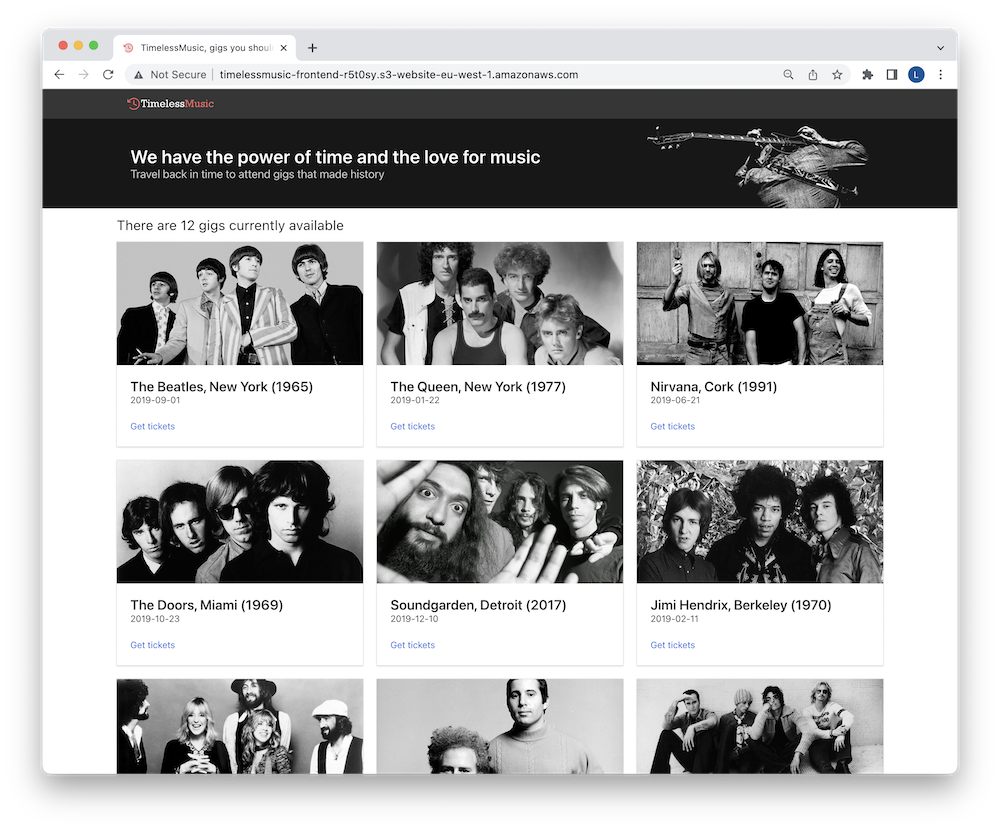

# Serverless e-commerce workshop

#### Making the "Timeless Music" project developed using Aws lambda and dynamodb suitable for Function Graph and GaussDB technologies on Huawei cloud.

## What are we going to build?

It turns out we have accidentally discovered time travel! 😱
## Demo


  

## Run on your computer

Clone the project

```bash
  git clone https://github.com/eastbloods/serverless-ecommerce-workshop
```

Navigate to the project directory

```bash
  cd serverless-ecommerce-workshop
```

## Working with Frontend

Install the required packages

```bash
  npm install
```

Start the dev server
```bash
npm run dev --workspace=frontend -- --open
```

Build frontend
```bash
npm run build --workspace=frontend
```

## Working with Backend

Start the dev server

```bash
node app.js
```
  
## Technologies Used

**Client:** React, Bootstrap

**Server:** Node, Express

**Huawei Cloud:** Function Graph, OBS, ECS, API Gateway, EIP, VPC, GaussDB, Cloud Eye


  
## Related Projects

Here are some related projects

[Timeless Music](https://github.com/fourTheorem/serverless-ecommerce-workshop)

  
## License

[MIT](https://choosealicense.com/licenses/mit/)

  
